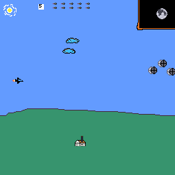

# game

my own game development in 6502 assembly for the NES

contents:
- asm assembly code
- chr character files (tiles)
- 8bit image files/sprites
- sound effects & music
- compiled nes roms

contains some images modelled after Star Wars (tm):
• tie fighters
• star destroyers
• death star

